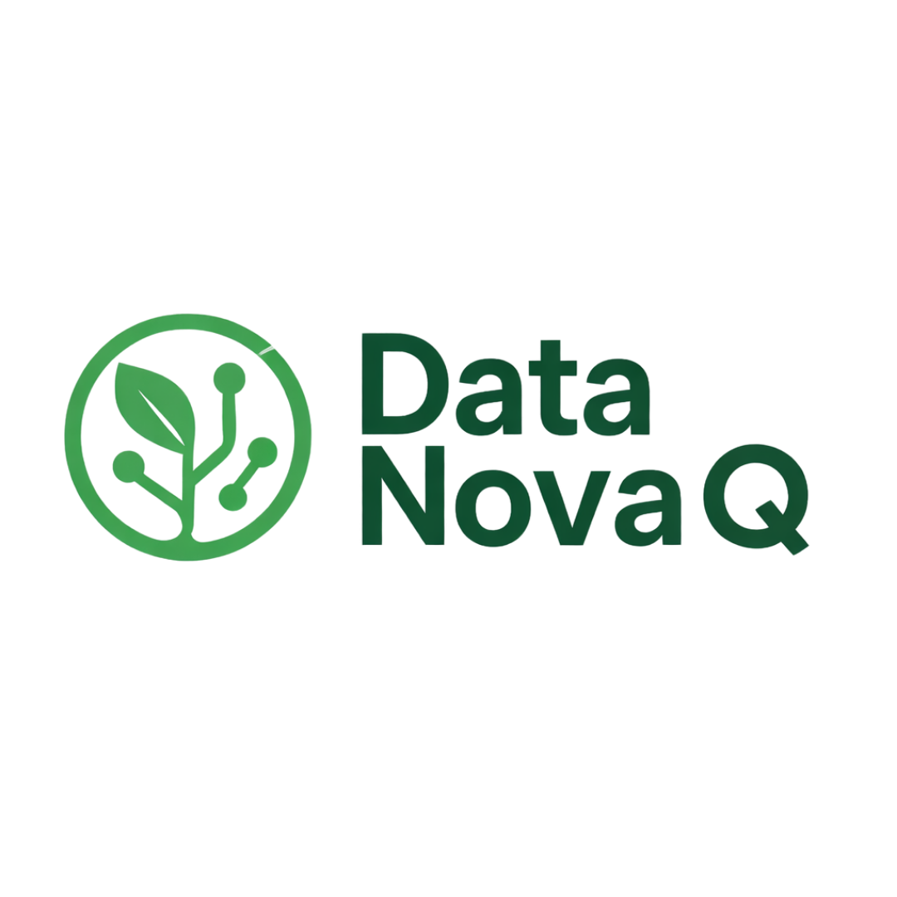

# Oussama Elmerrahi

**Data & AI Governance · Responsible AI · Digital Leadership**

Building trusted data foundations, responsible AI practices, and inclusive digital communities.

---

## Leadership

**[Visit DataNovaQ →](https://www.datanovaq.fr/)**

| Organization | Role | Mission |
|---|---|---|
| **[DataNovaQ](https://www.datanovaq.fr/)** | Data & AI Governance Lead | Turning governance principles into trusted, practical data and AI capabilities |
| **YAIL Paris Hub** | VP Regional Lead | Growing a collaborative community around youth, AI, and responsible innovation |
| **Youth IGF Morocco** | Founder | Empowering young people to shape an open, inclusive, and safe digital future |

## What I work on

- **Data governance:** ownership, stewardship, metadata, quality, lineage, and policy
- **AI governance:** responsible AI controls, accountability, risk, and compliance
- **Data platforms:** reliable engineering foundations that teams can trust and scale
- **Digital cooperation:** youth participation, capacity building, and Internet governance
- **Community leadership:** connecting people, ideas, and institutions across regions

## My approach

> Reliable by design · Governed by default · Responsible in practice · Built for people

I work at the intersection of technology, governance, and community. My goal is to make data and AI systems not only powerful, but also understandable, accountable, and useful to the people they serve.

## GitHub activity

---

**Open to meaningful conversations about Data Governance, AI Governance, Responsible AI, and youth digital leadership.**

